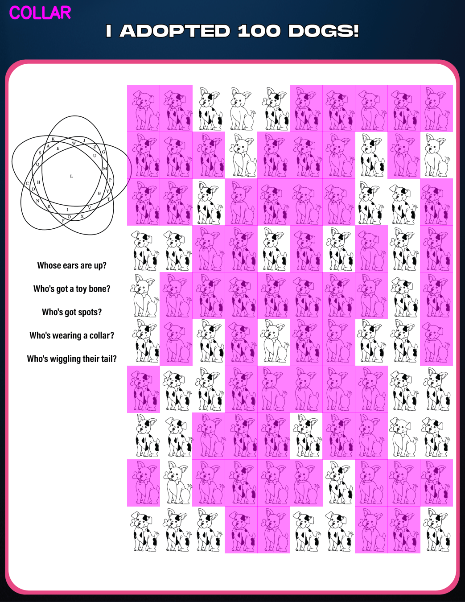
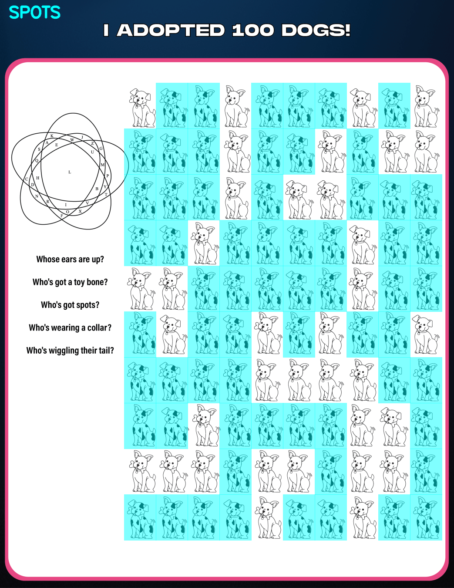
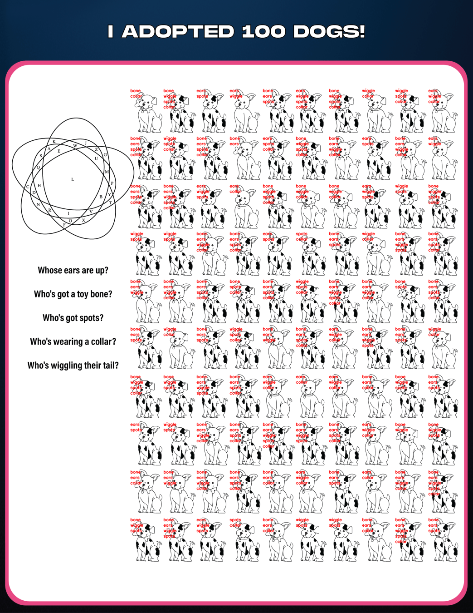

# 100 Dogs Puzzle

The puzzle is a 10x10 grid of dogs. Each dog has some combination of 5 visual properties: **bone**, **ears up**, **collar**, **spots**, and **tail wiggle**. Each unique combination of properties maps to a letter through a Venn diagram with 5 sets (A-E), where each set corresponds to one of the 5 properties — but we don't know which property maps to which set.

## Process

1. **Template matching** — Create templates for each of the 5 dog properties and use OpenCV template matching to classify every cell in the grid, identifying which properties each dog has.

2. **Property visualization** — Highlight each property group on the original image to verify the classifications are correct.

3. **Brute force permutations** — There are 5 properties and 5 Venn diagram sets, giving 120 possible assignments. Try all 120 permutations, converting each dog's property combination into a letter using the Venn diagram overlap table.

4. **Dictionary scoring** — For each permutation, check the resulting 10x10 letter grid against an English dictionary, looking for valid words in each row. The permutation that produced the most/longest dictionary words was selected as the correct mapping.

## Property Groups

## All Properties Labeled

## Final Solution

The decoded grid reads:

> **JUST A HUNDRED EXQUISITELY FUZZY PUPPIES CAN BE VIEWED LIKE AN ADVERB A NUMBER FROM A SPIELBERG MOVIE OR A FILM BY COPPOLA**

Which results in the answer: **Somewhere**
- An adverb
- A number from a Spielberg movie (*West Side Story*)
- A film by Coppola (*Somewhere*, 2010)
